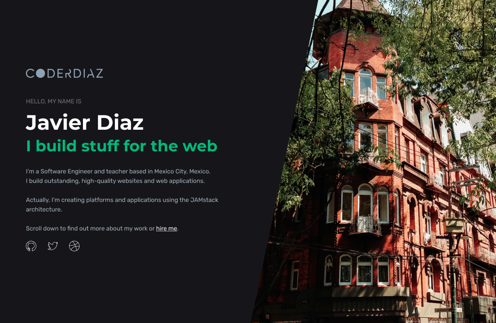

## coderdiaz.dev – 4.0.0
[](https://app.netlify.com/sites/coderdiaz/deploys)

The quarter iteration of [coderdiaz.dev](https://coderdiaz.dev), built with [Gatsby](https://www.gatsbyjs.org/) and [TailwindCSS](https://tailwindcss.com/) and hosted on [Netlify](https://www.netlify.com/).

Previous version: [3.0.0](https://github.com/coderdiaz/coderdiaz.github.io).



## Build Setup
```bash
# install dependencies
$ npm i
```

**coderdiaz.dev** @ 2020